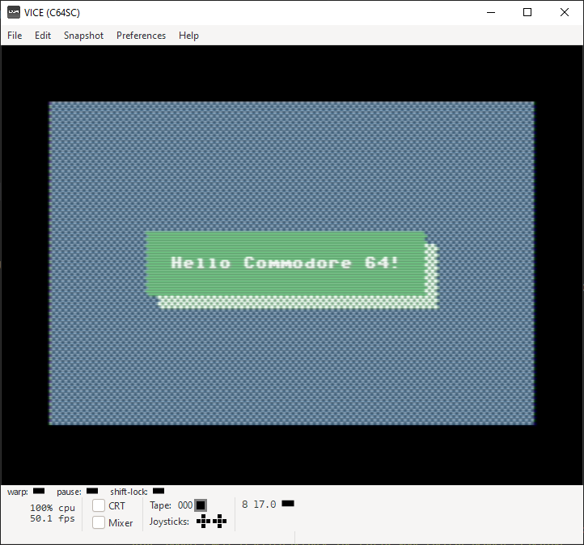

# c64-cc65-conio-demo
Just for fun:  creating PC-DOS style console i/o functions for the Commodore 64 in C

My environment includes WSL (Windows Subsystem for Linux) with Ubuntu Linux on Windows with cc65 compiler, GNU make utility, VICE Commodore 64 Emulator, and Visual Studio Code for editor.

## Use GNU make to build:

> $ make CC65_TARGET=c64

This will create target executable **test-c64** which you can drag and drop into the VICE Commodore 64 emulator.

## Functions:

### messagebox( x, y, message, text_color, bg_color )

### clearscreen( text_color, bg_color, border_color, fill_character )

## Known Issues:

- Having trouble with the conio textcolor() and bgcolor() functions.  They do not seem to like switching colors.  The last color selected wins.
